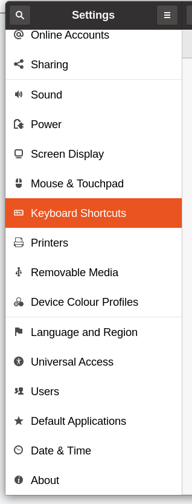
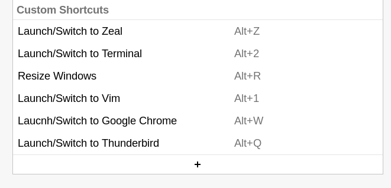
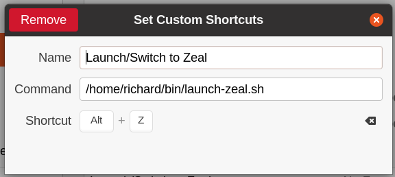

# x11-convenience-scripts
Scripts to manage windows and font sizes - only works in X11 and gnome

## Installation

Do `./install.sh` from this directory and check that `~/bin` is in
your `$PATH`

## Update

Do a git pull

## Using the Launch scripts with Keyboard shortcuts on Ubuntu

The `launch-*` scripts are best run from keyboard shortcuts which you
can setup here:

Load the setting app and find the Keyboard shortcuts here:

Then at the bottom, hidden away, you can add custom shortcuts:

Then you would add the settings here:

I do "Alt-1" for vim, "Alt-2" for terminal, "Alt-Q" for email and
"Alt-W" for google chrome.
